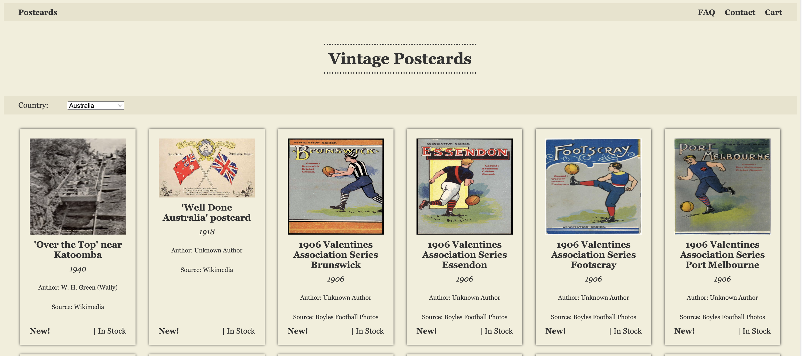

<i> Demo ecommerce website selling postcards. Created for CS 132 at Caltech. </i>
<p align="center">
  
</p>

## Setup

Install dependencies:
```
npm install
```

Create a .env file in the root directory and add port number (optional):
```
PORT=3000
```

Start the server:
```
node app.js
```
